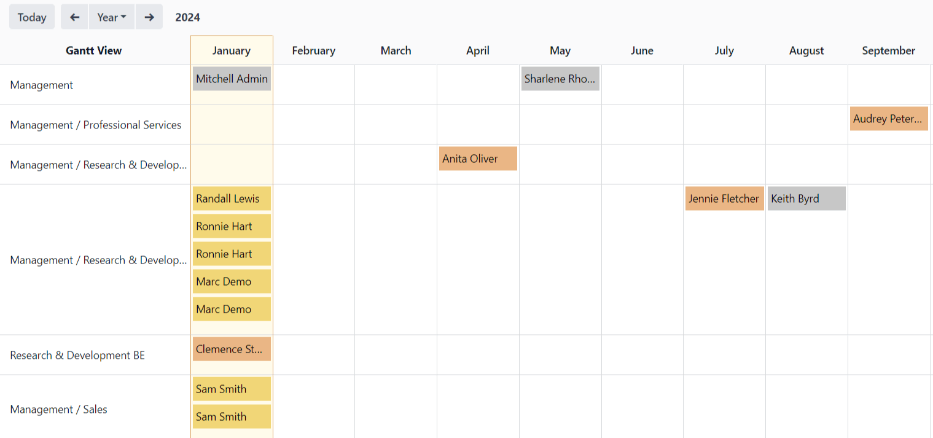
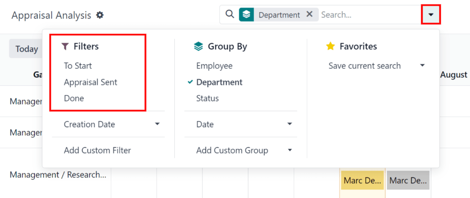
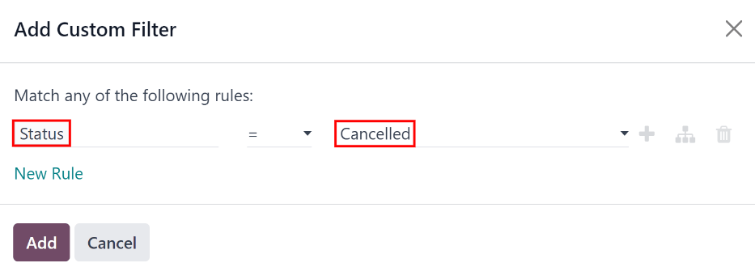
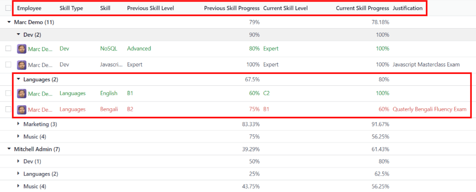
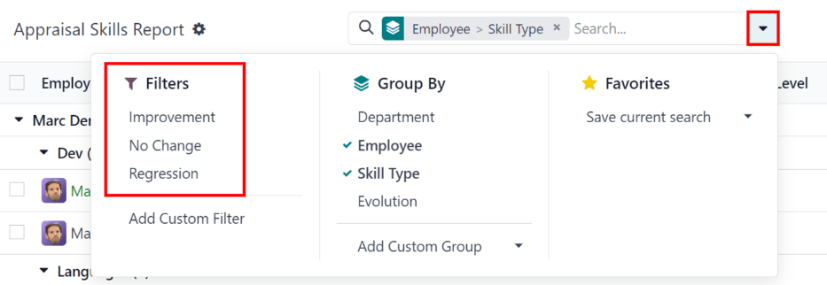

=========
Reporting
=========

In Odoo's *Appraisals* app, two metrics are tracked as appraisals are completed: an :ref:`appraisal
analysis <appraisals/analysis>`, and a :ref:`skills evolution <appraisals/skills-report>`.

.. _appraisals/analysis:

Appraisal analysis
------------------

To access the *Appraisal Analysis* report, navigate to :menuselection:`Appraisals app --> Reporting
--> Appraisal Analysis`.

On the :guilabel:`Appraisal Analysis` page, there is a report of all the appraisals in the database,
highlighted in different colors to represent their status.

Appraisals in yellow are completed, appraisals in orange are in progress (the appraisal is
confirmed, but not completed), appraisals in red have been cancelled, and appraisals in gray are
scheduled (according to the :ref:`appraisals/appraisal-plan`), but have not been confirmed yet.

The report displays the current year, in a default Gantt view, and is grouped by department.

To change the period of time that is presented by default, adjust the date settings in the top-left
of the report. The options to display are :guilabel:`Day`, :guilabel:`Week`, :guilabel:`Month`, and
:guilabel:`Year`. Use the arrows to move forward or backward in time.

At any point, click the :guilabel:`Today` button to have the Gantt view include today's date in the
view.

The report can have other filters and groupings set in the :guilabel:`Search...` bar at the top.

.. _appraisals/skills-report:

Filter appraisals
~~~~~~~~~~~~~~~~~

It is possible to only view appraisals with a specific status, by using one of the preconfigured
filters for the :guilabel:`Appraisal Analysis` report.

To view the available filters, click the :icon:`fa-caret-down` :guilabel:`(caret down)` icon in the
:guilabel:`Search...` bar.

In the :guilabel:`Filters` section on the left-side of the resulting drop-down menu, three options
are presented:

- :guilabel:`To Start`: select this filter to **only** present appraisals that have been scheduled
  (a date populates the :guilabel:`Appraisal Date` field on the appraisal form), but have **not**
  been confirmed. These appear in gray.
- :guilabel:`Appraisal Sent`: select this filter to **only** present appraisals that have been
  scheduled and confirmed, but have **not** been completed. This includes appraisals that have been
  confirmed but not started, as well as appraisals that are in-process. These appraisals appear in
  orange.
- :guilabel:`Done`: select this filter to **only** present appraisals that have been completed and
  marked as :guilabel:`Done`. These appraisals appear in yellow.

It is possible to select as many or as few filters as desired.

Custom filters
**************

Appraisals that have been canceled appear in red on the :guilabel:`Appraisal Analysis` report, but
there is no preconfigured filter to show only cancelled appraisals.

To view only cancelled appraisals, click the :icon:`fa-caret-down` :guilabel:`(caret down)` icon in
the :guilabel:`Search...` bar.

Next, click :guilabel:`Add Custom Filter` in the :guilabel:`Filters` section, and a :guilabel:`Add
Custom Filter` pop up window loads.

Using the drop-down menu, select :guilabel:`Status` for the :guilabel:`ID` field, then select
:guilabel:`Cancelled` for the second drop-down field. Click the :guilabel:`Add` button, and only
appraisals that have been cancelled appear.

Group appraisals
~~~~~~~~~~~~~~~~

The :guilabel:`Appraisal Analysis` report is grouped by :guilabel:`Department`, by default. This
grouping can be removed, and/or different groupings can be added.

To view the available grouping options, click the :icon:`fa-caret-down` :guilabel:`(caret down)`
icon in the :guilabel:`Search...` bar.

Active groupings have a green :icon:`fa-check` :guilabel:`(checkmark)` next to them. Click on a
grouping option to change its current status, either from active to inactive (or vice versa). Any
configuration of groupings can be selected.

The available default :guilabel:`Group By` options are:

- :guilabel:`Employee`: groups all appraisals by employee.
- :guilabel:`Department`: groups all appraisals by department.
- :guilabel:`Status`: groups all appraisals by their status.

Skills evolution
----------------

To access the *Skills Evolution* report, navigate to :menuselection:`Appraisals app --> Reporting
--> Skills Evolution`. The :guilabel:`Appraisal Skills Report` page displays a report of all skills,
grouped by employee.

Skill levels are **only** updated after an appraisal is marked as done. Any skill level changes from
any ongoing appraisals that have **not** been finalized are **not** included in this report.

All the lines of the report are collapsed, by default. To view the details of a line, click anywhere
on a line to expand the data.

Each skill has the following information listed:

- :guilabel:`Employee`: name of the employee.
- :guilabel:`Skill Type`: the category the skill falls under.
- :guilabel:`Skill`: the specific, individual skill.
- :guilabel:`Previous Skill Level`: the level the employee had previously achieved for the skill.
- :guilabel:`Previous Skill Progress`: the previous percentage of competency achieved for the skill
  (based on the :guilabel:`Skill Level`).
- :guilabel:`Current Skill Level`: the current level the employee has achieved for the skill.
- :guilabel:`Current Skill Progress`: the current percentage of competency achieved for the skill.
- :guilabel:`Justification`: any notes entered on the skill, explaining the progress.

The color of the skill text indicates any changes from the previous appraisal. Skill levels that
have increased since the last appraisal appear in green, skill levels that have not changed appear
in black, and skills that have *regressed* appear in red.

Filter skills
~~~~~~~~~~~~~

It is possible to only view skills that have changed over time, by using one of the preconfigured
filters for the :guilabel:`Appraisal Skills Report`.

To view the available filters, click the  :icon:`fa-caret-down` :guilabel:`(caret down)` icon in the
:guilabel:`Search...` bar.

In the :guilabel:`Filters` section on the left-side of the resulting drop-down menu, three options
are presented:

- :guilabel:`Improvement`: select this filter to **only** present skills that have increased since
  the last appraisal. All skills appearing with this filter have green text, indicating the skill
  level has improved.
- :guilabel:`No Change`: select this filter to **only** present skills that have remained at the
  same skill level since the last appraisal. All skills appearing with this filter have black text,
  indicating there has been no change in the skill level.
- :guilabel:`Regression`: select this filter to **only** present skills that have decreased since
  the last appraisal. All skills appearing with this filter have red text, indicating the skill
  level has dropped.

It is possible to select as many or as few filters as desired.

Group skills
~~~~~~~~~~~~

The :guilabel:`Appraisal Skills Report` is grouped by two categories, :guilabel:`Employee` and
:guilabel:`Skill Type`, by default. These groupings can be removed, and/or different groupings can
be added.

To view the available grouping options, click the :icon:`fa-caret-down` :guilabel:`(caret down)`
icon in the :guilabel:`Search...` bar.

Active groupings have a green :icon:`fa-check` :guilabel:`(checkmark)` next to them. Click on a
grouping option to change its current status, either from active to inactive (or vice versa). Any
configuration of groupings can be selected.

The available default :guilabel:`Group By` options are:

- :guilabel:`Department`: groups all skills by department.
- :guilabel:`Employee`: groups all skills by employee.
- :guilabel:`Skill Type`: groups all skills by individual skill types.
- :guilabel:`Evolution`: groups all skills by the following evolutions: :guilabel:`Decline`,
  :guilabel:`Improvement`, :guilabel:`Just Added`, and :guilabel:`Same`.
