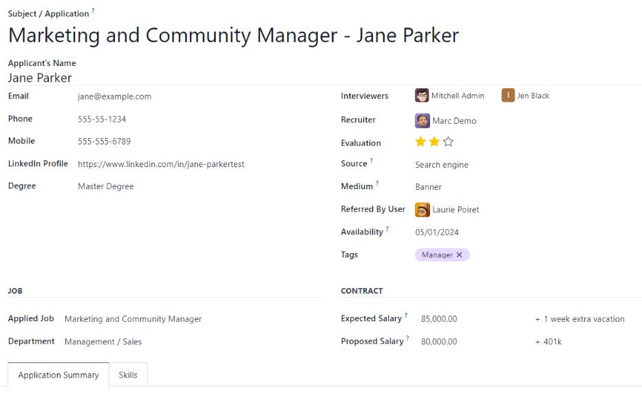

==================
Add new applicants
==================

Once an applicant submits an application, either using the online application, or emailing a job
position alias, an applicant card is automatically created. However, in some instances, applicants
may need to be created manually in the database. This could be necessary if, for example, a company
accepts paper applications in the mail, or is meeting prospective applicants at an in-person job
fair.

To view current applicants, navigate to the :menuselection:`Recruitment` app, then click on a job
position card. All applicants for that job position appear in a default Kanban view, organized by
stage.

If an applicant needs to be added to the list of prospective candidates, an applicant card can be
easily added from this job position Kanban view in one of two ways: using either the :ref:`New
<recruitment/create-new-applicant>` button or the :ref:`quick add <recruitment/quick-add-applicant>`
button .

.. _recruitment/create-new-applicant:

New applicant form
==================

Add a new applicant, including all the relevant information, using the :guilabel:`New` button.

If not already in the Kanban view for the job position to add an applicant to, first navigate to the
main :menuselection:`Recruitment` app dashboard, then click on a job position card. Next, click the
:guilabel:`New` button in the top-left of the Kanban view and a blank applicant form loads.

The :guilabel:`Subject / Application` field is populated with the job position, by default. Certain
ther fields on the applicant card may be pre-populated, depending on how the job position is
configured. Typically, the :guilabel:`Job` section, as well as the :guilabel:`Recruiter` field, are
all pre-populated.

Enter the following information on the new applicant form. Note that not all fields listed below may
be visible. Depending on installed applications and configurations, some fields may not be
displayed.

.. _recruitment/applicant-details:

Applicant section
-----------------

- :guilabel:`Subject/Application Name`: this is the only required field. Enter the title for the
  card. Typically this is the applicant's name and job position being applied to, for example:
  `John Smith - Experienced Developer`. This field is not visible in the Kanban view, unless the
  :guilabel:`Applicant's Name` is left blank. If there is no :guilabel:`Applicant's Name`, then the
  :guilabel:`Subject/Application Name` is what is displayed on the applicant card in the Kanban
  view.
- :guilabel:`Applicant's Name`: enter the applicant's name.
- :guilabel:`Email`: enter the applicant's email address.
- :guilabel:`Phone`: enter the applicant's phone number.
- :guilabel:`Mobile`: enter the applicant's mobile number.
- :guilabel:`LinkedIn Profile`: enter the web address for the applicant's personal profile on
  LinkedIn.
- :guilabel:`Degree`: select the applicant's highest level of education earned from the drop-down
  menu. Options are :guilabel:`Graduate`, :guilabel:`Bachelor Degree`, :guilabel:`Master Degree`, or
  :guilabel:`Doctoral Degree`. The :guilabel:`Graduate` option indicates graduating the highest
  level of school before a Bachelor's degree, such as a high school or secondary school diploma,
  depending on the country.
- :guilabel:`Interviewers`: using the drop-down menu, select the people who will conduct the
  interview(s). The selected people must have either *recruiter* or *officer* rights configured for
  the Recruitment application to appear in the drop-down list.
- :guilabel:`Recruiter`: select the person responsible for the entire recruitment process for the
  job position. Only *users* can be selected, and all users are presented in the drop-down to
  select from.
- :guilabel:`Evaluation`: click on one of the stars to select a rating for the applicant. One star
  indicates :guilabel:`Good`, two stars indicates :guilabel:`Very Good`, and three stars indicates
  :guilabel:`Excellent.`
- :guilabel:`Source`: using the drop-down menu, select where the applicant learned about the job
  position. The following options come pre-configured in Odoo: :guilabel:`Search engine`,
  :guilabel:`Lead Recall`, :guilabel:`Newsletter`, :guilabel:`Facebook`, :guilabel:`Twitter`,
  :guilabel:`LinkedIn`, :guilabel:`Monster`, :guilabel:`Glassdoor`, and :guilabel:`Craigslist`. To
  add a new :guilabel:`Source`, type in the source, then click :guilabel:`Create "(new source)"`.
- :guilabel:`Medium`: using the drop-down menu, select the method, or :guilabel:`Medium`, for the
  :guilabel:`Source` that the applicant found the job listing with. The pre-configured options are:
  :guilabel:`Banner`, :guilabel:`Direct`, :guilabel:`Email`, :guilabel:`Facebook`, :guilabel:`Google
  Adwords`, :guilabel:`LinkedIn`, :guilabel:`Phone`, :guilabel:`Television`, :guilabel:`Twitter`
  (now known as "X"), or :guilabel:`Website`. To add a new :guilabel:`Medium`, type in the medium,
  then click :guilabel:`Create "(new medium)"`.
- :guilabel:`Referred By User`: if referral points are to be earned for this job position in the
  *Referrals* application, select the user who referred the applicant from the drop-down menu. The
  *Referrals* application must be installed for this field to appear.
- :guilabel:`Availability`: select the available start date for the applicant. To select a date,
  click on the field to reveal a calendar. Use the :guilabel:`< (left)` and :guilabel:`> (right)`
  arrows on either side of the month to navigate to the desired month, then click on the
  :guilabel:`day` to select the date. If no entry is selected that indicates the applicant is ready
  to begin work immediately.
- :guilabel:`Tags`: select as many tags as desired from the drop-down menu. To add a tag that does
  not exist, type in the tag name, then click :guilabel:`Create "new tag"`.

Job section
-----------

The following fields are pre-populated when creating a new applicant, as long as these field are
specified on the Job Position. Editing the fields is possible, if desired.

- :guilabel:`Applied Job`: select the job position the applicant is applying to from the drop-down
  menu.
- :guilabel:`Department`: select the department the job position falls under from the drop-down
  menu.
- :guilabel:`Company`: select the company the job position is for using the drop-down menu. This
  field only appears when in a multi-company database.

Contract section
----------------

- :guilabel:`Expected Salary`: enter the amount the applicant is requesting for the role in this
  field. The number should be in a `XX,XXX.XX` format. The currency is determined by the
  localization setting for the company.
- :guilabel:`Extra advantages...`: if any extra advantages are requested by the applicant, enter it
  in the :guilabel:`Extra advantages...` field to the right of the :guilabel:`Expected Salary`
  field. This should be short and descriptive, such as `1 week extra vacation` or `dental plan`.
- :guilabel:`Proposed Salary`: enter the amount to be offered to the applicant for the role in this
  field. The number should be in a `XX,XXX.XX` format. The currency is determined by the
  localization setting for the company.
- :guilabel:`Extra advantages...`: if any extra advantages are offered to the applicant, enter it in
  the :guilabel:`Extra advantages...` field to the right of the :guilabel:`Proposed Salary` field.
  This should be short and descriptive, such as `unlimited sick time` or `retirement plan`.

Application summary tab
-----------------------

Any additional details or notes that should be added to the applicant's card can be typed into this
field.

Skills tab
----------

Skills can be added to the applicant's card. To add a skill, follow the same steps as outlined in
the skills section of the :ref:`Create new employees <employees/skills>` document.

.. _recruitment/quick-add-applicant:

Quick add
=========

Quickly add a new applicant using the *quick add* button. If not already in the job position Kanban
view, navigate to the main recruitment dashboard by going to :menuselection:`Recruitment app -->
Applications --> By Job Positions`. Click the :guilabel:`(#) New Applications` button on the job
position card that the applicant should be added to. Then, click on the small :icon:`fa-plus`
:guilabel:`(plus)` icon in the top-right of the :guilabel:`New` stage to quickly add a new
applicant.

Enter the following information on the card:

- :guilabel:`Subject/Application`: Enter the title for the card. Typically this is the applicant's
  name and job position being applied to, for example: `Laura Smith - HR Manager`. This field is not
  visible in the Kanban view, unless the :guilabel:`Applicant's Name` is left blank. If there is no
  :guilabel:`Applicant's Name`, then the :guilabel:`Subject/Application Name` is what is displayed
  on the applicant card in the Kanban view.
- :guilabel:`Applicant's Name`: enter the applicant's name.
- :guilabel:`Email`: enter the applicant's email address.
- :guilabel:`Applied Job`: the current job position populates this field. If needed, the job
  position can be changed by selecting a different position from the drop-down menu. If a different
  job position is selected, after the card is created, the card appears in the selected job
  position.

After the information is entered, click :guilabel:`Add`. The applicant appears in the list, and a
new blank applicant card appears. Click either the :icon:`fa-trash-o` :guilabel:`delete` icon or
anywhere on the screen to close the card.

If preferred, after entering the applicant name, click :guilabel:`Edit` and a detailed
:guilabel:`Applicant Form` loads. :ref:`Enter the information on the form
<recruitment/applicant-details>`.

