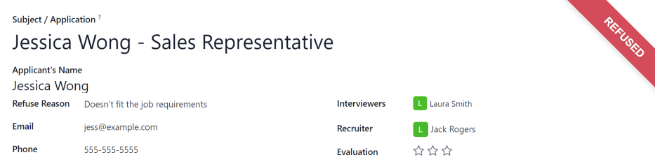

=================
Refuse applicants
=================

At any point in the recruitment process, an applicant can be refused for a job position. To refuse
an applicant, click on an applicant's card to navigate to a detailed view of the card. At the top of
the applicant's card, there are several buttons. Click the one labeled :guilabel:`Refuse`.

.. _recruitment/refuse-reasons:

Refuse reasons
==============

A :guilabel:`Refuse Reason` pop-up window appears. Click the desired :guilabel:`Refuse Reason` from
the presented options. The default refuse reasons in Odoo, and their corresponding email templates,
are:

.. list-table::
   :header-rows: 1
   :stub-columns: 1

   * - Email Template
     - Refusal Reason
   * - :guilabel:`Recruitment: Refuse`
     - | :guilabel:`Doesn't fit the job requirements`
       | :guilabel:`Language issues`
       | :guilabel:`Role already fulfilled`
       | :guilabel:`Duplicate`
       | :guilabel:`Spam`
   * - :guilabel:`Recruitment: Not interested anymore`
     - | :guilabel:`Refused by Applicant: don't like job`
       | :guilabel:`Refused by Applicant: better offer`
       | :guilabel:`Refused by Applicant: salary`

Additional refusal reasons :ref:`can be created and existing ones can be modified or deleted
<recruitment/new-refuse>`.

.. note::
   Pre-configured email templates in Odoo sometimes use dynamic placeholders, which are customized
   pieces of data that populate dynamic content. For example, if the applicant's name is a piece of
   dynamic content, the applicant's name appears anytime that dynamic placeholder appears on the
   email template. For more detailed information on email templates, refer to the
   :doc:`../../general/companies/email_template` documentation.

.. _recruitment/new-refuse:

Create or modify refuse reasons
-------------------------------

To view all currently configured refuse reasons, navigate to :menuselection:`Recruitment app -->
Settings --> Applications: Refuse Reasons`. All the refuse reasons appear in a list view.

To create a new refuse reason, click the :guilabel:`New` button in the top-left corner. A blank
line appears at the bottom of the :guilabel:`Description` column.

Type in the new refuse reason in the field. It is recommended to enter a reason that is short and
concise, such as `offer expired` or `withdrew application`.

Then, in the :guilabel:`Email Template` field, click on the field to reveal a drop-down menu.
Select an :guilabel:`Email Template` from the list to be used when this refuse reason is selected.

If a new :guilabel:`Email Template` is desired, type in the name for the new template in the field.
Then, click :guilabel:`Create and edit...` and a :guilabel:`Create Email Template` form pop-up
window appears.

Enter a :guilabel:`Name` for the form and an email :guilabel:`Subject` in the corresponding fields.
Enter the email content in the :guilabel:`Content` tab. Make any other desired modifications to the
template, then click :guilabel:`Save & Close` to save the template and return to the
:guilabel:`Refuse Reasons` list. The new template appears in the new refuse reason :guilabel:`Email
Template` field.

To make any modifications to a refuse reason, click on the line, and make any desired changes.

Send refusal email
==================

After a :ref:`Refuse Reason <recruitment/refuse-reasons>` is selected, two fields appear below the
refusal reason: :guilabel:`Send Email` and :guilabel:`Email Template`.

The applicant's email address automatically populates the :guilabel:`Send Email` field; additional
email recipients cannot be added. If an email should **not** be sent to the applicant, uncheck the
:guilabel:`Send Email` checkbox.

The email template associated with the refusal reason populates the :guilabel:`Email Template`
field. If a different email template is desired, select a different template from the
:guilabel:`Email Template` drop-down menu. To view the email template, click the
:icon:`fa-external-link` :guilabel:`Internal link` icon to the right of the :guilabel:`Email
Template` field. The email template loads in a :guilabel:`Open: Email Template` pop-up window, and
can be modified if needed. After making modifications, click :guilabel:`Save & Close`.

To send the refusal email to the applicant, click :guilabel:`Refuse`. The refusal email is sent to
the applicant, and a red :guilabel:`Refused` banner appears on the applicant's card in the top-right
corner.

View refused applicants
=======================

After refusal, the applicant's card is no longer visible in the job position's Kanban view. However,
it is still possible to view applicant's who have been refused.

Job position view
-----------------

To view only the refused applicants for that job position, click the :icon:`fa-caret-down`
:guilabel:`(caret down)` button in the :guilabel:`Search...` box, then click :guilabel:`Refused`
under the :guilabel:`Filters` section.

All applicants that have been refused for the job position appear, in the stage they were when they
were refused.

All applicants view
-------------------

To view all applicants that have been refused from all job positions, navigate to the
:menuselection:`Recruitment app --> Applications --> All Applications`.

Click the :icon:`fa-caret-down` :guilabel:`(caret down)` button in the :guilabel:`Search...` box,
then click :guilabel:`Refused` under the :guilabel:`Filters` section.

All applications for all job positions are presented in a list view, organized by stage. The text
for each refused applicant appears in red.

